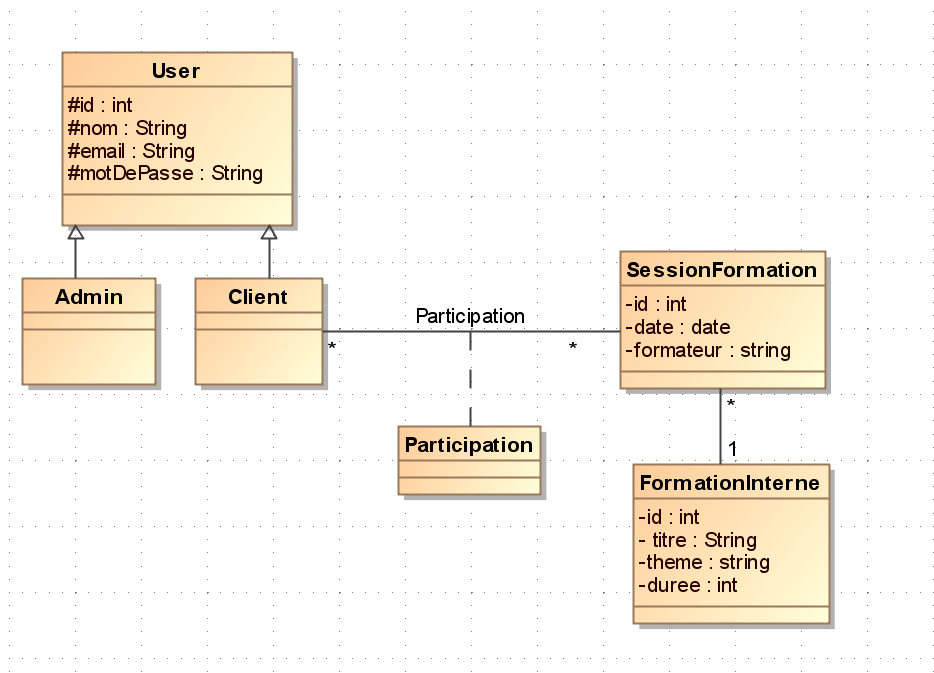
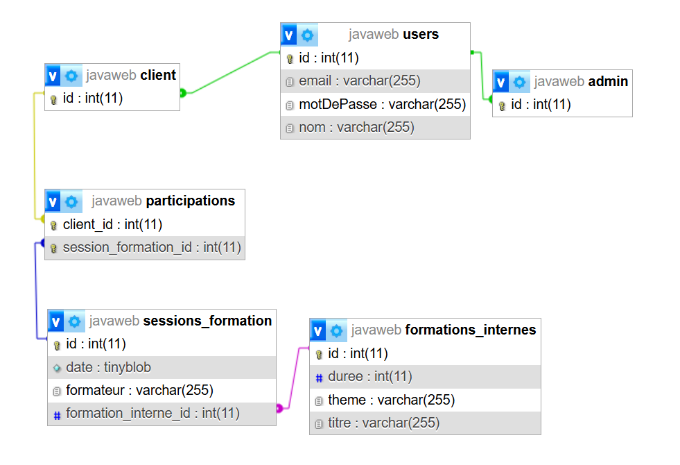
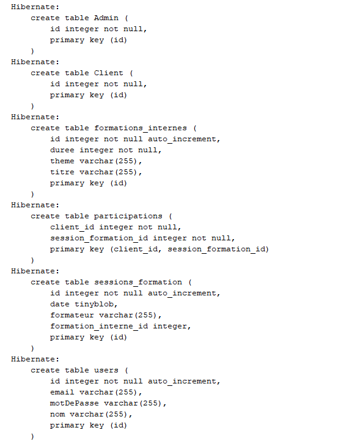
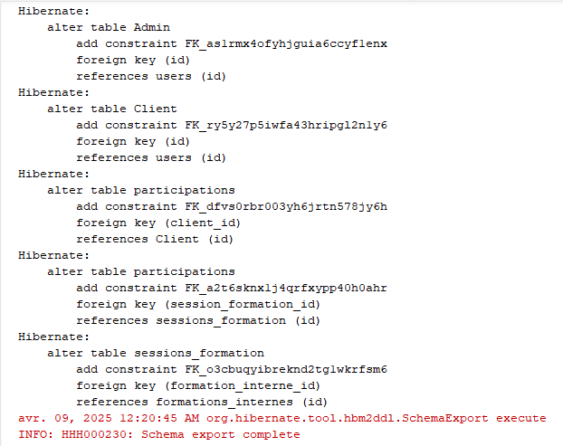
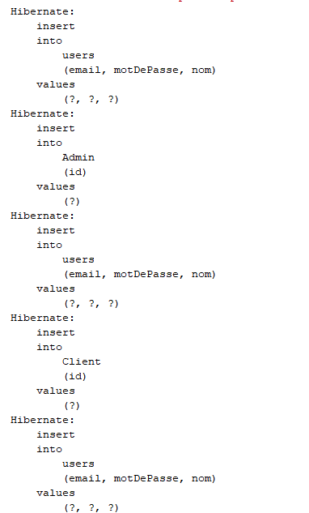
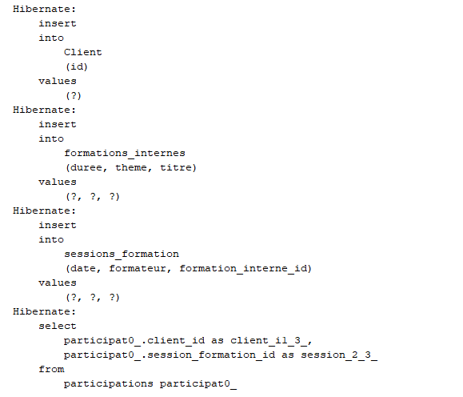

# Gestion des Formations Internes d'Entreprise

## Contexte

Au sein de nombreuses entreprises, la formation continue des employés est un pilier essentiel pour le développement des compétences, l'adaptation aux évolutions du marché et l'amélioration de la performance globale. La gestion de ces formations internes, allant de la planification des sessions à l'inscription des employés et au suivi de leur parcours, peut rapidement devenir complexe sans un système organisé.

Actuellement, la gestion des formations internes au sein de notre entreprise est potentiellement réalisée de manière manuelle (tableaux, emails, etc.) ou via des outils non spécifiques, entraînant des difficultés telles que :

* **Manque de visibilité sur l'offre de formation :** Les employés peuvent ne pas être pleinement informés des formations disponibles et de leur calendrier.
* **Processus d'inscription laborieux :** L'inscription aux sessions peut être longue et nécessiter de multiples échanges.
* **Difficulté de suivi des participations :** Il est complexe d'avoir une vue d'ensemble des formations suivies par chaque employé et des taux de participation par formation.
* **Absence de statistiques exploitables :** Le manque de données centralisées rend difficile l'analyse de l'efficacité des formations et l'identification des besoins futurs.

## Problématique

Le manque d'un système centralisé et efficace pour la gestion des formations internes engendre plusieurs problèmes :

* **Inefficacité administrative :** La gestion manuelle consomme du temps et des ressources, augmentant le risque d'erreurs et de perte d'informations.
* **Faible engagement des employés :** Un manque de clarté sur l'offre et un processus d'inscription complexe peuvent décourager la participation aux formations.
* **Difficulté d'évaluation de l'impact des formations :** Sans données structurées sur la participation, il est difficile de mesurer le retour sur investissement des actions de formation.
* **Prise de décision basée sur des informations incomplètes :** L'absence de statistiques fiables entrave la capacité à adapter l'offre de formation aux besoins réels de l'entreprise et des employés.

## Objectif

L'objectif principal de ce projet est de développer une application web conviviale et efficace pour la gestion des formations internes de l'entreprise. Cette application permettra de :

* **Centraliser l'information :** Offrir un point d'accès unique à toutes les informations concernant les formations (titre, thème, durée), les sessions (date, formateur) et les participants.
* **Simplifier la planification et l'inscription :** Faciliter la consultation du planning des sessions et permettre aux employés de s'inscrire rapidement aux formations qui les intéressent.
* **Assurer le suivi des participations :** Maintenir un historique précis des formations suivies par chaque employé.
* **Fournir des statistiques claires :** Générer des visualisations (via Chart.js) sur la participation par formation afin d'identifier les tendances et d'évaluer l'intérêt des employés.
* **Améliorer l'expérience utilisateur :** Offrir une interface intuitive et des fonctionnalités d'inscription rapide (via AJAX) pour encourager l'engagement des employés dans leur développement professionnel.

En résumé, l'objectif est de moderniser la gestion des formations internes, d'améliorer l'efficacité administrative, d'accroître l'engagement des employés et de fournir des données exploitables pour optimiser la stratégie de formation de l'entreprise.

## Diagramme de classe

## Modèle conceptuel de la base généré

## Exécution des tests dans la console

